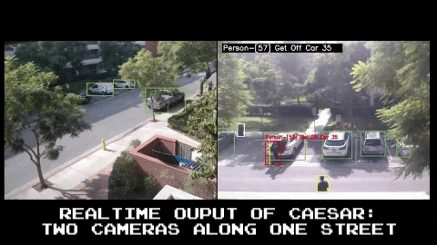
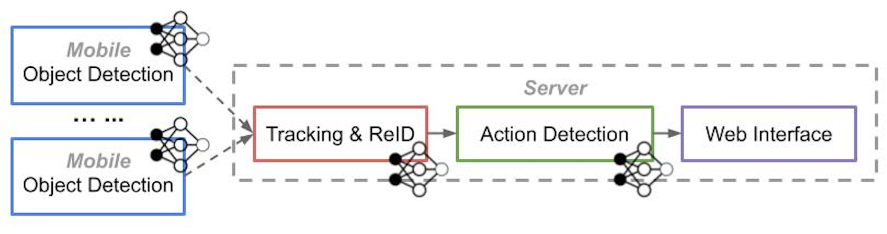

# Caesar: Cross-Camera Complex Activity Detection



## Code Structure
The workflow is shown in the image below. You will run one of the scripts to turn the device into a mobile/tracker/action/web node. 



- ```mobile/``` src code for object detection
- ```tracker/``` src code for tracking and ReID
- ```server/``` src code for action detection
- ```web/``` src code for web interface 
- ```network/``` src code for I/O and RPC
- ```config/``` config file for the system setup  
- ```main_xxx.py``` the main script to run the node 
- ```checkpoints/``` folder that contains the model files 
- ```data/``` a test video is here 
- ```misc/``` scripts for debugging/testing

## Requirements
- Python 3.X
- OpenCV 3.X
- TensorFlow 1.12+
- Install other py packages using ```pip install -r requirements.txt```

## Run the Pipeline
1. Clone the repo with 
```
git clone https://github.com/USC-NSL/Caesar.git
```
2. **Prepare models** (download the models to the ```checkpoints/``` folder)
- Object Detection (Option-1: [MobileNet-V2](http://download.tensorflow.org/models/object_detection/ssd_mobilenet_v2_coco_2018_03_29.tar.gz), Option-2: [YOLOv2](https://pjreddie.com/darknet/yolov2/)). 
- ReID ([DeepSort](https://drive.google.com/open?id=1m2ebLHB2JThZC8vWGDYEKGsevLssSkjo))
- Action Detection ([ACAM](https://drive.google.com/open?id=138gfVxWs_8LhHiVO03tKpmYBzIaTgD70)). For ACAM-related setup, please look at [its repo](https://github.com/oulutan/ACAM_Demo) and make sure your environment can run its demo code.

3. **Update config files to your settings**
All the files you need to change are in ```config/``` folder.
- Modify ```label_mapping.txt``` to parse your object detector's output (key is the integer class id, value is the string object label). The default one is for SSD-MobileNetV2.
- Modify ```camera_topology.txt``` to indicate the camera connectivity (see the inline comments in the file for detail)
- Modify ```act_def.txt``` to define your complex activity using the syntax (see the inline comments in the file for detail)
- Modify ```const_xxx.py``` to specify the model path, threshold, machine ip, etc., for this node (mobile, tracker, action, web). Read the inline comments for detail

4. **Run the node**
- For a mobile node, run ```python main_mobile.py``` (need GPU). If you are using a mobile GPU like Nvidia TX2, please set the board to the best-performance mode for max FPS. Here is a [tutorial for TX2](https://www.jetsonhacks.com/2017/03/25/nvpmodel-nvidia-jetson-tx2-development-kit/). 
- On a server: Run one of ```python main_tracker.py``` / ```python main_act.py``` / ```python main_web.py``` (the tracker and the act node need GPU).

5. **About the runtime**
- All the node will periodically ping their next hop for reconnection, so it doesn't matter what order you start/end these nodes. 
- Each node will save logs into a ```debug.log``` text file in the home dir 
- If you want to end one node, press Ctrl-C to exit, some node may need Ctrl-C second time to be fully ended. 


## Supported Action Vocabulary
You can add more DNN-generated single-tube actions, check **FAQ** for how to do.  
- *Cross-tube actions*: ```close```, ```near```, ```far```, ```approach```, ```leave```, ```cross```
- *Single-tube actions*: ```start```, ```end```, ```move```, ```stop```, ```use_phone```, ```carry```, ```use_computer```, ```give```, ```talk```, ```sit```, ```with_bike```, ```with_bag```

## Run Caesar Node by Node (Offline)
Instead of running all the nodes online, you may want to just run part of the workflow and check the intermediate results (like detection and tracknig). Therefore, you will need to follow these:
- First, turn on the ```SAVE_DATA``` in ```xx_const.py``` so a node could save its results to an npy file under ```res/[main_node_name]``` 
- Then, you can run ```main_gt.py```. This script will act as node that reads the raw videos and the npy data. It could render the data in frames (e.g. detections, track ids, actions) so you can see them without running the webserver. Moreover, it upload the data to the next running node. Parameters for ```main_gt.py``` can be changed in ```config/const_gt.py```. 

**Example:** 
- Run ```main_mobile.py``` only on several videos and get the data saved. Then you can config the npy data source to be the mobile's output for ```main_gt.py``` (speicify this in its config file ```config/const_gt.py```). Moreover, you should make the tracker node's IP as the server address for ```main_gt.py```. 
- Then, run ```main_tracker.py``` and ```main_gt.py```. Now ```main_gt.py``` displays the mobile's detection result, and also uploads the data to the tracker node for tracking.
- When finished, you can see the tracker's npy file in its own result folder. Set this file to be the source data path in ```main_gt.py``` and change its server address to ```main_act.py```. 
- Now you can run ```main_gt.py``` again but as a tracker node, and use it to input to ```main_act.py``` for action results. You can repeat the process for debugging ```main_web.py``` in the last step. 

## FAQ
**Q:** Object detection on Nvidia TX2 is slow, how to make it faster? 
- **A:** Instead of using the default MobileNet model, you should use its optimized [TensorRT](https://developer.nvidia.com/tensorrt) version for TX2. Nvidia has a chain to squeeze the model so it runs much faster. Here is the [tutorial for generating the TensorRT model](https://medium.com/datadriveninvestor/object-detection-on-nvidia-jetson-tx2-6090dc3e0595). You can download ours [here](https://drive.google.com/file/d/1lrke7fRxRDnFfgHvzfz8D1LxFLi3QjLF/view?usp=sharing). The useage of TensorRT model is the same as regular model. With TensorRT, we increase the detection FPS from 4 to 10.5.

**Q:** I want to enable more DNN-detected single tube action, how to do that?
- **A:** Go to ```config/const_action.py```, add the action name and its detection threshold to the ```NN_ACT_THRES```. Make sure that the action name is already in ```ACTION_STRINGS```.

**Q:** How to run two mobile nodes on the same machine?
- **A:** Duplicate ```config/const_mobile.py``` with a different name (e.g. ```const_mobile2.py```) and edit it to match the settings for the second camera. Then make a copy of ```main_mobile.py``` to be ```main_mobile2.py```. In the main file line ??, change the ```from config.const_mobile``` to be ```from config.const_mobile2```.

**Q:** The end-to-end delay is long, how to optimize?
- **A:** (1) Disable the web node and directly show the visualized result at act node. We will add this function later. (2) Initiate more action DNN instances. We will add this as an option so you can easily config. 

**If you have any other issues, please leave your questions in "issues"**
